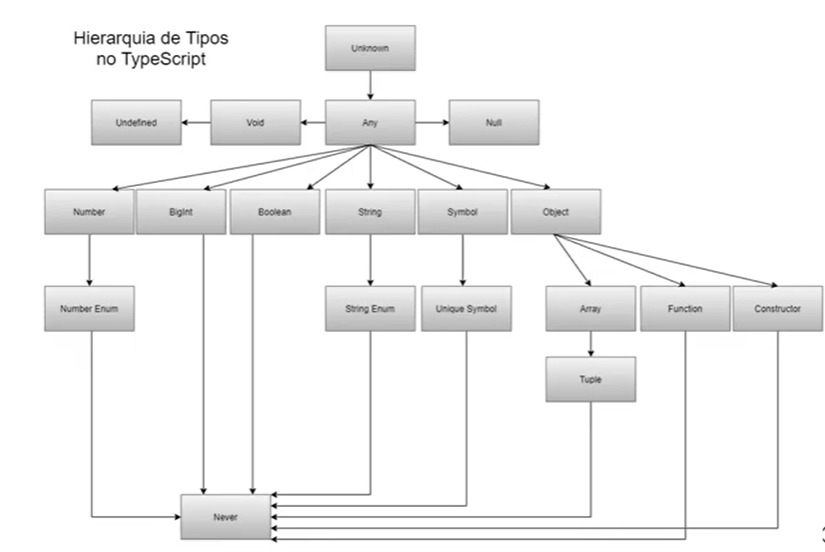
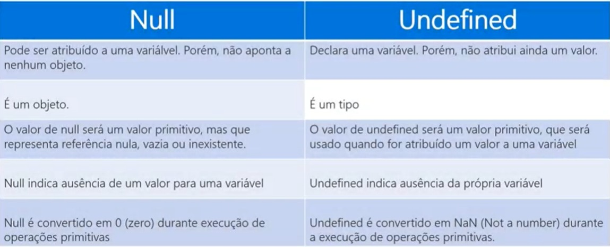

# Curso Typescript - Zero to Hero
## Por Gláucia Lemos

[Playlist no Youtube](https://www.youtube.com/playlist?list=PLb2HQ45KP0Wsk-p_0c6ImqBAEFEY-LU9H)

[Documentação oficial TS](https://www.typescriptlang.org/)

### **Módulo 1 - Introdução ao Typescript**

TypeScript is a strongly typed programming language which builds on JavaScript giving you better tooling at any scale.

Assim como JSX, precisa ser transpilado para JS para ser executado no navegador. Possui um compilador que faz isso depois de verificar a tipagem do código (linguagem altamente tipada).

- open source e desenvolvimento aberto
- padrão ECMAScript
- tipagem estática e inovadora
- manutenção contínua (por novas features)
- desenvolvido e mantido pela comunidade técnica
- melhoras ferramentas para uso

### *Preparando o ambiente de desenvovimento*

- [Node.js](https://nodejs.org/en/)
- [Typescript](https://www.typescriptlang.org/download)
- [Visual Studio Code](https://code.visualstudio.com/download)

### *Entendendo o arquivo tsconfig.json*

Deve estar incluso em todo projeto que utiliza TS, normalmente no diretório raíz. Contém configuraões importantes.
````
{
    "compilerOptions": {
        "lib": ["es2015"],  //define quais apis o TS deve presumir que esse ambiente possui
        "module": "commonjs",   //qual sistema de módulo o TS deve compilar
        "outDir": "dist",   //onde o arquivo transpilado deve ser gerado
        "sourceMap": true,  
        "strict": true,     //garante que todo o seu código será digitado corretamente
        "target": "es2015"  //define qual versão do JS que o TS vai ser transpilado
    },
    "include": [ //pastas que o TS deve procurar para encontrar seus arquivos .ts
        "src"
    ]
}
````
[**Referências contidas no tsconfig.json**](https://typescriptlang.org/pt/tsconfig)

### *Transpilando um arquivo .ts*

- Digitando no terminal `tsc <nome do arquivo>`: será criado um arquivo .js com o código transpilado;

- Gerando um arquivo `tsconfig.json`: na raiz do projeto, execute `tsc --init` para a criação automática do arquivo de configuração do TS.

### *Por que TypeScript?*

- Permite usar ES6, ES7, ES8, ES2020...
- Forte apoo a POO (Programação Orientada a Objetos) e FRP (Functional Reactive Programming)
- Possui tipagem estática. O que torna mais fácil para depurar o código
- Retorna os erros antes do tempo de execução. O que evita quebrar o código antes dele ser executado

### **Módulo 2 - Tipos básicos em TypeScript**

1) *Type annotation*: especifica o tipo - number, boolean, string, etc
````
let nomeVariavel: TypeAnnotation = valor;
````
Exemplo:
````
function adicionarNumeros(num1: number, num2: number) {
    return num1 + num2;
}
````
*Hierarquia de tipos* 



2) *Boolean*: um dos tipos primitivos do TS que aceita 2 valores: true ou false.
````
let nomeVariavel: boolean = true;
````
**Importante!**
> Boolean != boolean

- Boolean - tipo Object
- boolean - tipo primitivo: mais recomendado para ser usado em aplicações

3) *Number & Bigint*: 
- number - conjunto de números (inteiros, flutuantes, positivos, negativos, infinito, NaN etc.)
- bigint - valores maiores que 2^53

````
let nomeVariavel: number = valor;
--
let nomeVariavel: bigint = valor (seguido com 'n');
````

**Importante!**
> Tipo *bigint* disponível somente a partir do es2020 ou ESNEXT.

4) *String*: objeto que representa a sequência de caracteres, tipo de dado primitivo usado para armazenar texto.

````
let nomeVariavel: string = 'valor';
let nomeVariavel: string = "valor";
````

[Curso TypeScript Microsoft Learning](https://docs.microsoft.com/en-us/learn/paths/build-javascript-applications-typescript/)

5) *Array*: lista ordenada de dados.
````
let frutas: string['abacaxi', 'laranja', 'maca', 'uva'];
let precos: number[10, 5, 3, 7];
let nomeVariavel: type[];
````

6) *Tuple*: coleção heterogênea de valores, armazenamento de campos de diferentes tipos. Podem ser passadas como parâmetros para funções. Considerada um array com número fixo de elementos.

````
let nomeTupla = [valor1, valor2, valor3, ... valorN];
let pessoa: [string, string, number];
````

7) *Enums*: Enumerar os valores, estruturas de dados não ordenadas. Mapeiam chaves para valores. TS suporta Enums numéricos e baseados em String. VAlores no singular e com a primeira letra maiúscula.

````
Enum TypeName {
    constant1,
    constant2,
    ...
}
````

**Por que usar Enums?**

- Facilidade em mudar valores
- Reduz erros
- Funciona somente em tempo de compilação
- O tempo de execução (compile-time) será mais preciso e rápido
- Permite criar constantes
- Permite criar constantes personalizadas

**Enum numérico**
````
enum Idioma {
    Portugues, 
    Espanhol,
    Ingles,
    Alemao
}
````
Resultado:
````
{
    '0': 'Portugues',
    '1': 'Espanhol',
    '2': 'Ingles',
    '3': 'Alemao'
}
````

**Enum String**
````
enum Idioma {
    Portugues = 'PT-BR',
    Espanhol = 'ES',
    Ingles = 'EN',
    Alemao = 'DE'
}
console.log(Idioma.Portugues)       //Resultado: 'PT-BR'
````

8) *Any*: Padrinho dos tipos, tipo padrão em TS. Evitar ao máximo usar esse tipo, pois em TS ele pode ser qualquer tipo.
````
let nomeVariavel: any = valor;
````

9) *Unknown*: Usa-se quando não sabe qual tipo definir, evitando problemas no código. A diferença para o tipo *Any* se dá na verificação do tipo antes de realizar qualquer operação durante a execução do código. Todos os tipos podem ser atribuídos a *Unknown*.
````
let nomeVariavel: unknown = valor;
````

10) *Void*: Oposto do tipo *Any*. Função retorna nenhum valor. Melhora a clareza do código, Garante a segurança de tipo. Representa que o tipo de uma função ou método não retornará nenhum dado ou valor.
````
function exemploFuncao(mensagem): void {}
````

11) *Null*: Ausência intencional de valor. Variável valor é indefinida e só aceita apenas um valor.

12) *Undefined*: Variáveis não inicializadas. Possui apenas um valor. Função que não retorna um valor.

**Diferenças entre Null e Undefined:**

